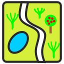

ioBroker gardena adapter
=================
[](https://www.npmjs.com/package/iobroker.gardena)
[](https://www.npmjs.com/package/iobroker.gardena)

[](https://nodei.co/npm/iobroker.gardena/)

[](https://travis-ci.org/t4qjXH8N/ioBroker.gardena)
[](https://ci.appveyor.com/project/t4qjXH8N/iobroker-gardena/branch/master)

This is an [ioBroker](https://github.com/ioBroker/ioBroker) Adapter supporting the Gardena Smart System web service.  

## Description

This adapter connects to the Gardena Smart System web services. From this web service data from all devices  is retrieved and stored in ioBroker states. These states are updated in a given interval, hence the states should be up to date. At the moment it can retrieve data from all Gardena devices. Some Gardena devices can be controlled.

The adapter mainly maps Gardena's RESTful API structure to ioBroker's database structure. The adapter distinguishes between "dump" and "smart" datapoints. Dump datapoints are directly mapped from Gardena's RESTful API to the ioBroker database. Smart datapoints are mapped in a "smart" way: If the datapoint has children that contain metadata, the metadata from these children is used to create one smart datapoint in the ioBroker database. Only smart datapoints can be writeable. If this is the case, a special datapoint is created in the ioBroker's database that can be used to trigger the command. Hence many devices should be supported in a generic way. For experts, all HTTP PUT commands should be supported by smart datapoints.    

There are some devices that require sending special commands that are not supported by SMART datapoints. For exports, these are commands send by the HTTP POST command. These commands have to be described in the file "gardena_commands.json" in the lib folder. At the moment it contains the commands for a Sileno mower only. Since these commands have to be revealed by monitoring the connection between the Gardena app and the Gardena cloud server, I cannot test all of them. If you have a device that is not supported and you want to contribute, you could do the following on Android devices: 

1. Install the [GARDENA Smart System App](https://play.google.com/store/apps/details?id=com.gardena.smartgarden&hl=en) on the android phone, if not yet installed.
2. Install an app for sniffing the traffic between the app and the web service on your phone. I like [Packet Capture](https://play.google.com/store/apps/details?id=app.greyshirts.sslcapture&hl=en).
3. Activate the sniffer and send a command to the device using the GARDENA Smart System app.
4. Send me the retrieved JSON via [Email](mailto:chvorholt@gmail.com) or, even better, add the commands to [gardena_commands.json](/lib/gardena_commands.json) for yourself and open a pull request. For example, a JSON send by the Gardena app may look like this:

```json
POST /sg-1/devices/[DeviceID]/abilities/mower/command?locationId=[LocationID] HTTP/1.1
Host: sg-api.dss.husqvarnagroup.net
Connection: keep-alive
Content-Length: 52
Origin: https://sg-api.dss.husqvarnagroup.net
Content-Type: application/json; charset=UTF-8
Accept: application/json, text/javascript, */*; q=0.01
Authorization-Provider: husqvarna
X-Requested-With: XMLHttpRequest
Referer: https://sg-api.dss.husqvarnagroup.net/sg-1/index/android/
Accept-Encoding: gzip, deflate
Accept-Language: de-DE,en-US;q=0.9

{
  "name": "park_until_further_notice",
  "parameters": {}
}
```

## Installation
Just install the adapter from the iobroker admin interface or fetch it from Github.

## Donation
If this project help you reduce time to develop, you can give me a cup of coffee or a bottle of beer via PayPal(chvorholt@gmail.com) :-)  

## Changelog
# 2.0.1 (22-Oct-2018)
- fixed problem where some SMART states were not updated
- improved role guessing

# 2.0.0 (21-Oct-2018)
- brand new interface that allows to setup a whitelist for datapoints
- strongly reduced CPU and RAM load
- all devices that can be controlled by HTTP PUT commands are supported
- some preparations for adding the adapter to the ioBroker repository in the future

# 1.2.0 (05-Aug-2018)
- support for Gardena [smart irrigation control](https://www.gardena.com/int/products/smart/smart-system/pim94995109/967669901/)

# 1.1.0 (23-Jul-2019)
- new devices can be added more easily 

# 1.0.1 (17-Jul-2018)
- readded travis/appveyor testing

# 1.0.0 (17-Jul-2018)
- added support for Admin3

# 0.1.1 (15-Jul-2018)
- minimum polling time is 60 seconds

# 0.1.0 (22-Apr-2018)
- commands can be parametrized by designated states

# 0.0.3 (08-Apr-2018)
- bugfix: state was updated only once

## Disclaimer
I am not in any association with Gardena or Husqvarna.

## License
The MIT License (MIT)

Copyright (c) 2017-2018 Christian Vorholt <chvorholt@gmail.com>

Permission is hereby granted, free of charge, to any person obtaining a copy
of this software and associated documentation files (the "Software"), to deal
in the Software without restriction, including without limitation the rights
to use, copy, modify, merge, publish, distribute, sublicense, and/or sell
copies of the Software, and to permit persons to whom the Software is
furnished to do so, subject to the following conditions:

The above copyright notice and this permission notice shall be included in
all copies or substantial portions of the Software.

THE SOFTWARE IS PROVIDED "AS IS", WITHOUT WARRANTY OF ANY KIND, EXPRESS OR
IMPLIED, INCLUDING BUT NOT LIMITED TO THE WARRANTIES OF MERCHANTABILITY,
FITNESS FOR A PARTICULAR PURPOSE AND NONINFRINGEMENT. IN NO EVENT SHALL THE
AUTHORS OR COPYRIGHT HOLDERS BE LIABLE FOR ANY CLAIM, DAMAGES OR OTHER
LIABILITY, WHETHER IN AN ACTION OF CONTRACT, TORT OR OTHERWISE, ARISING FROM,
OUT OF OR IN CONNECTION WITH THE SOFTWARE OR THE USE OR OTHER DEALINGS IN
THE SOFTWARE.
